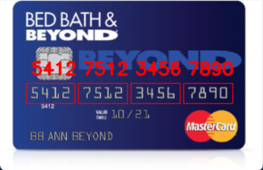

- ## [Source: 迪哥谈AI](https://www.bilibili.com/video/BV1jc411s7gN?p=16)
- ### Display:
  - **Original picture**

    
   - **contour picture**
     
    
    - **result picture**
      
    

- ### Procedure:
    - #### get template for each digit 
    - #### get the contour for the region to be matched
      - **the each digit with the same size of the digit template**
      - to get the contour of digit region on the card, we can do these steps：
        1. **top hat** -- which highlight the brighter part e.g. digit\pattern\letter etc.
        2. **sobel gradient** -- to remain and enforce the edge information
        3. **MORPH_CLOSE** -- morphological close operation (first dilate then erode), blending the remaining region togather
        4. **THRESH_OTSU** -- find the suitable threshold automatically, then make it binary, preparing for finding the contour
        5. **Selecting the proper contour based on the known size (width/lengtn/ration etc.)**
     
    - #### How to choose the kernel for morphological operation based on task?
      - **Meaning for morphology close operation**:
        1. **Fill small black holes** in the while frontgrond
        2.**Connect Broken White Areas**
        3. **Smooth Object Borders**
       
      - **9x3 rectangle kernel**: Used for the first close operation, which better to manipulate on a string of **horizontal** numbers or characters and blend them togather
      - **5x5 square kernel**:  Further smooth and fill in any small holes or unconnected areas that may still exist after the first operation
